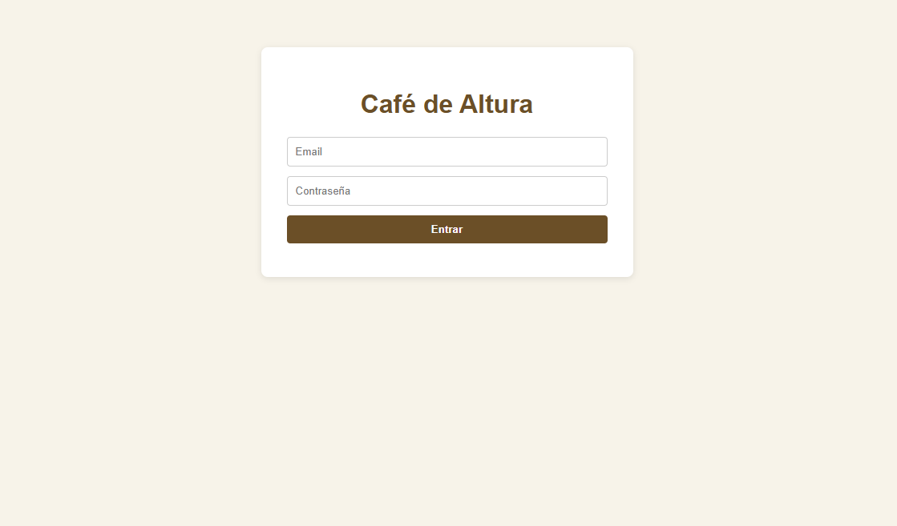
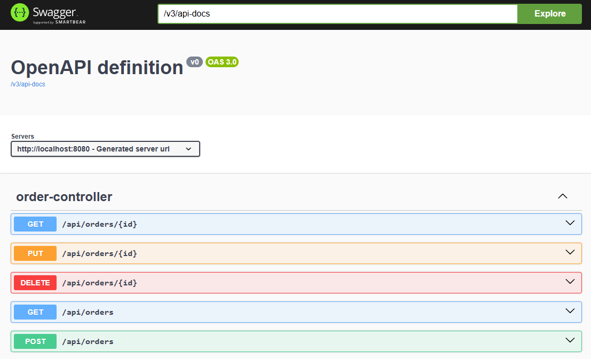
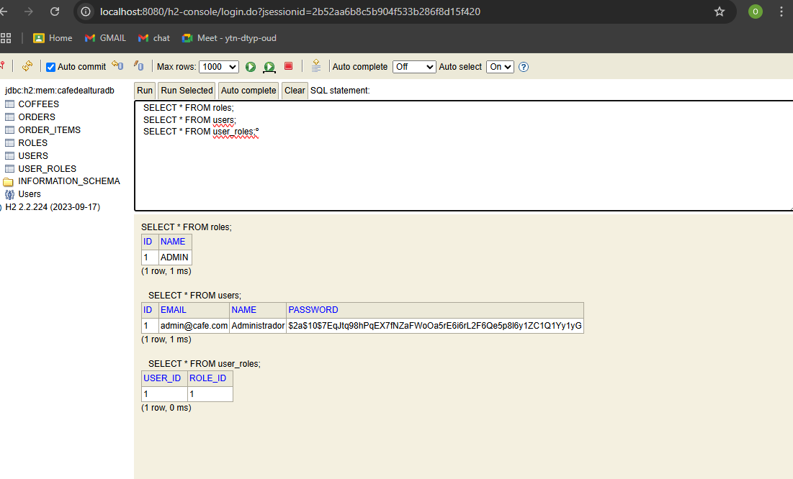

# ☕️ CafedeAltura

¡Bienvenido a CafedeAltura!

Sistema completo para la gestión de una cafetería, desarrollado con Java y Spring Boot. Incluye autenticación JWT, gestión de productos, pedidos y usuarios, así como panel de administración y documentación interactiva.

---

## ✨ Funcionalidades principales

- **Autenticación y autorización JWT:**
  Registro y login de usuarios con protección de endpoints mediante tokens JWT y roles (`USER`, `ADMIN`).
- **Gestión de usuarios:**
  Registro, login seguro y consulta de perfil y roles.
- **Gestión de cafés:**
  CRUD completo de productos de café. Solo los administradores pueden modificar o eliminar cafés.
- **Gestión de pedidos:**
  Creación, consulta, actualización y cancelación de pedidos según estado y permisos.
- **Panel de administración:**
  Acceso a estadísticas y gestión avanzada solo para usuarios con rol `ADMIN`.
- **Documentación interactiva:**
  Swagger UI para probar y explorar todos los endpoints de la API.
- **Base de datos en memoria (H2):**
  Visualización y gestión de datos en tiempo real desde la consola H2.

---

## 📋 Tabla de Contenidos

- [Instalación](#-instalación)
- [Estructura del Proyecto](#-estructura-del-proyecto)
- [Demo](#-demo)
- [Uso](#-uso)
- [Tecnologías](#-tecnologías)
- [Contribución](#-contribución)
- [Contacto](#-contacto)
- [Agradecimientos](#-agradecimientos)

---

## 🛠️ Instalación

1. **Clona el repositorio:**
   ```bash
   git clone <URL-DEL-REPO>
   cd cafedealtura
   ```
2. **Compila el proyecto:**
   ```bash
   mvn clean install
   ```
3. **Ejecuta la aplicación:**
   ```bash
   mvn spring-boot:run
   ```
4. **Accede a la app:**
   - Swagger UI: [http://localhost:8080/swagger-ui/index.html](http://localhost:8080/swagger-ui/index.html)
   - H2 Console: [http://localhost:8080/h2-console](http://localhost:8080/h2-console)

---

## 📁 Estructura del Proyecto

```
cafedealtura/
│
├── src/
│   ├── main/
│   │   ├── java/com/cafeteria/cafedealtura/
│   │   │   ├── domain/      # Lógica de negocio (usuarios, pedidos, café)
│   │   │   ├── security/    # Seguridad y JWT
│   │   │   ├── controller/  # Controladores REST
│   │   │   └── ...          
│   │   └── resources/
│   │       ├── application.properties
│   │       └── data.sql
│   └── test/
│
├── pom.xml
└── README.md
```

---

## 🚀 Demo


_Pantalla de login de la aplicación web_


_Interfaz de Swagger UI para probar la API REST_


_Visualización de la base de datos en la consola H2_

---

## 🧪 Uso

- **Login de ejemplo:**
  - Email: `admin@cafe.com`
  - Contraseña: `Admin123` (recuerda la mayúscula)

- **Probar la API:**
  1. Ve a Swagger UI.
  2. Usa `/api/auth/login` para obtener tu token JWT.
  3. Haz clic en "Authorize" e ingresa:
     ```
     Bearer <tu_token>
     ```
  4. Prueba los endpoints protegidos.

---

## 🧰 Tecnologías

- Java 17
- Spring Boot 3
- Spring Security (JWT)
- H2 Database
- Maven
- Swagger/OpenAPI

---

## 🤝 Contribución

¿Te gustaría mejorar el proyecto?  
Haz un fork, crea una rama y envía tu PR. ¡Toda contribución es bienvenida!

---

## 📬 Contacto

- **Autor:** Oscar Lopez ([GitHub](https://github.com/OscarL0pez))
- **Profesor:** Angel David Macho
- **Email:** oscar.lopez@students.gammatech.school

---

## 🙏 Agradecimientos

Gracias a todas las personas inplicadas en este boot-camp Alex,Angel y Sonia;Al profesor Angel David Macho por su guía y apoyo durante el desarrollo de esta ultima parte del proyecto.  
Este trabajo es parte de mi formación como desarrollador backend.

---

> _Proyecto entregado como parte de la asignatura de Desarrollo Backend. Todos los derechos reservados._
